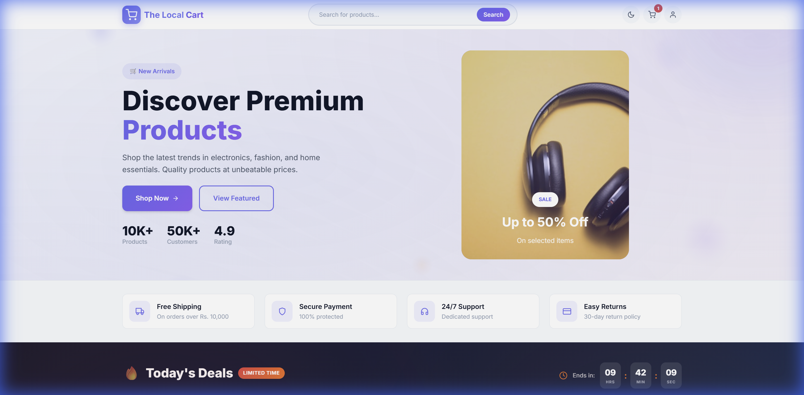
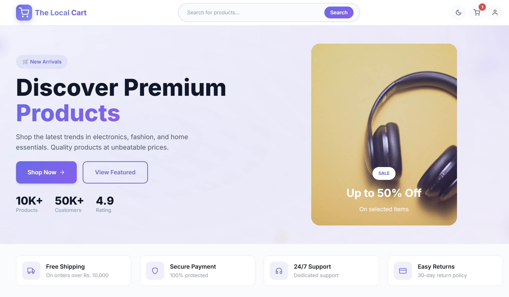
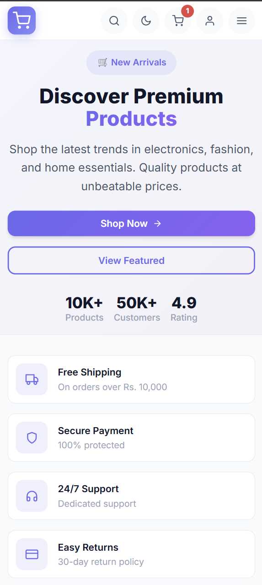
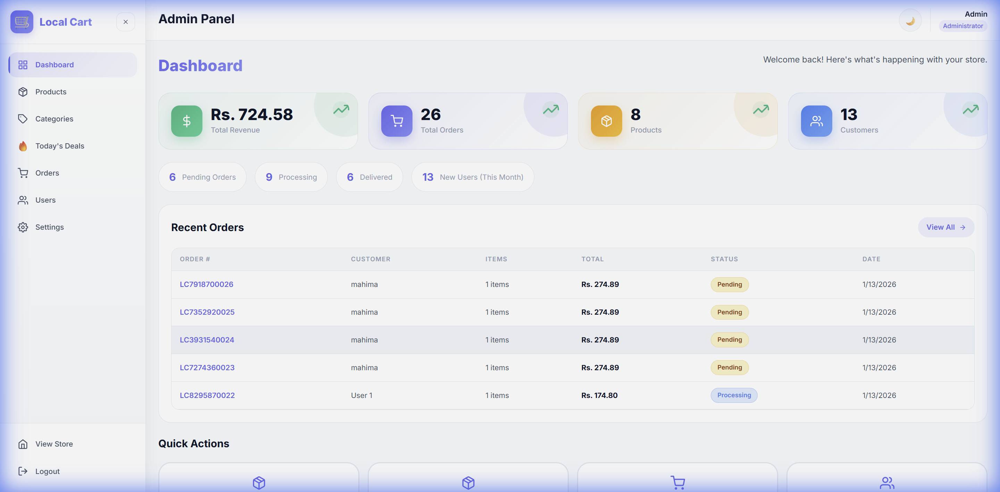
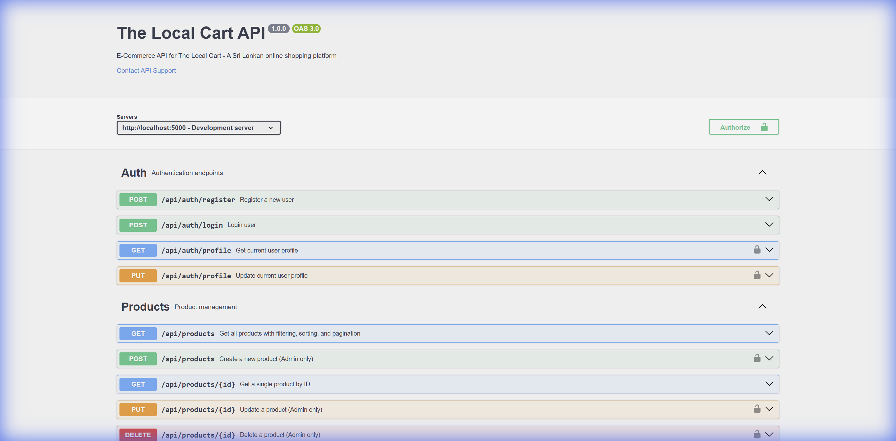

# 🛒 The Local Cart - Full-Stack MERN E-Commerce Platform

> **A modern, production-ready e-commerce web application** built with React, Node.js, Express, and MongoDB. Designed for the Sri Lankan market with LKR currency support, featuring a complete shopping experience with admin dashboard.

[](https://thelocalcart.vercel.app/)
[](https://localcart-ecommerce.onrender.com/api-docs)
[](https://github.com/mahimapaseda/localcart-ecommerce)



---

## 📋 Table of Contents

- [About](#-about)
- [Features](#-features)
- [Tech Stack](#️-tech-stack)
- [Screenshots](#-screenshots)
- [API Documentation](#-api-documentation)
- [Getting Started](#-getting-started)
- [Project Structure](#-project-structure)
- [Deployment](#-deployment)
- [Contributing](#-contributing)
- [License](#-license)

---

## 🎯 About

**The Local Cart** is a fully functional e-commerce platform that demonstrates modern web development practices. Built as a complete MERN stack application, it showcases:

- **Frontend Development**: React 18 with hooks, Context API for state management, and Framer Motion animations
- **Backend Development**: RESTful API design with Express.js, JWT authentication, and MongoDB database
- **DevOps**: Deployed on Vercel (frontend) and Render (backend) with MongoDB Atlas cloud database
- **Documentation**: Interactive Swagger/OpenAPI documentation for all API endpoints

### 🌟 Key Highlights

| Feature | Description |
|---------|-------------|
| **Full-Stack Architecture** | Complete separation of concerns with React frontend and Express backend |
| **Authentication System** | Secure JWT-based auth with password hashing using bcrypt |
| **Responsive Design** | Mobile-first CSS with dark mode support |
| **Admin Dashboard** | Complete store management with analytics |
| **API Documentation** | Interactive Swagger UI for testing endpoints |
| **Production Ready** | Deployed and live on cloud platforms |

---

## ✨ Features

### 🛍️ Customer Features

| Feature | Description |
|---------|-------------|
| **Product Catalog** | Browse products with advanced filtering, sorting, and search functionality |
| **Shopping Cart** | Add items, update quantities, supports both guest and authenticated users |
| **Secure Checkout** | Complete checkout flow with shipping address and payment options |
| **User Authentication** | Register, login, and manage user profiles with JWT tokens |
| **Wishlist** | Save favorite products for later purchase |
| **Order Tracking** | View complete order history with status updates |
| **Dark Mode** | Toggle between light and dark themes for better UX |
| **Mobile Responsive** | Optimized for all device sizes with mobile-first design |

### 👨‍💼 Admin Features

| Feature | Description |
|---------|-------------|
| **Dashboard Analytics** | Sales overview, revenue tracking, and order statistics |
| **Product Management** | Full CRUD operations for products with image support |
| **Category Management** | Organize products with hierarchical categories |
| **Deals & Promotions** | Create and manage special offers and discounts |
| **Order Management** | Process orders, update status, and track shipments |
| **User Management** | View and manage customer accounts |
| **Store Settings** | Configure store information, payment methods, and notifications |

---

## 🛠️ Tech Stack

### Frontend Technologies

| Technology | Version | Purpose |
|------------|---------|---------|
|  | 18.2 | UI Component Library |
|  | 5.0 | Build Tool & Dev Server |
|  | 6.21 | Client-Side Routing |
|  | 1.6 | HTTP Client |
|  | 12 | Animations & Transitions |
|  | 5.0 | Icon Library |

### Backend Technologies

| Technology | Version | Purpose |
|------------|---------|---------|
|  | 18+ | JavaScript Runtime |
|  | 4.18 | Web Application Framework |
|  | 8.0 | NoSQL Database |
|  | 8.0 | MongoDB ODM |
|  | 9.0 | Token Authentication |
|  | 3.0 | API Documentation |

### Deployment & DevOps

| Service | Purpose |
|---------|---------|
|  | Frontend Hosting |
|  | Backend Hosting |
|  | Cloud Database |

---

## 📸 Screenshots

### Homepage


### Today's Deals


### Featured Products


### Mobile Responsive Design


### Admin Dashboard


### API Documentation (Swagger)


---

## 📚 API Documentation

Interactive API documentation powered by **Swagger UI (OpenAPI 3.0)** is available at:

🔗 **Live API Docs:** [https://localcart-ecommerce.onrender.com/api-docs](https://localcart-ecommerce.onrender.com/api-docs)

### RESTful API Endpoints

| Endpoint | Methods | Description | Auth Required |
|----------|---------|-------------|---------------|
| `/api/auth` | POST | User authentication (login, register) | No |
| `/api/auth/profile` | GET, PUT | User profile management | Yes |
| `/api/products` | GET, POST, PUT, DELETE | Product CRUD operations | Admin for write |
| `/api/products/:id/reviews` | POST | Add product reviews | Yes |
| `/api/categories` | GET, POST, PUT, DELETE | Category management | Admin for write |
| `/api/cart` | GET, POST, PUT, DELETE | Shopping cart operations | Yes |
| `/api/orders` | GET, POST, PUT | Order management | Yes |
| `/api/users` | GET, PUT, DELETE | User management | Admin |
| `/api/settings` | GET, PUT | Store configuration | Admin for write |

---

## 🚀 Getting Started

### Prerequisites

- **Node.js** 18.x or higher
- **MongoDB** (local installation or MongoDB Atlas account)
- **npm** or **yarn** package manager
- **Git** for version control

### Installation

1. **Clone the repository**
   ```bash
   git clone https://github.com/mahimapaseda/localcart-ecommerce.git
   cd localcart-ecommerce
   ```

2. **Install server dependencies**
   ```bash
   cd server
   npm install
   ```

3. **Install client dependencies**
   ```bash
   cd ../client
   npm install
   ```

4. **Configure environment variables**

   Create `.env` file in the `server` folder:
   ```env
   PORT=5000
   MONGODB_URI=mongodb://localhost:27017/localcart
   JWT_SECRET=your_secure_jwt_secret_key
   NODE_ENV=development
   ```

5. **Start the development servers**

   Terminal 1 - Backend:
   ```bash
   cd server
   npm run dev
   ```

   Terminal 2 - Frontend:
   ```bash
   cd client
   npm run dev
   ```

6. **Access the application**

   | Service | URL |
   |---------|-----|
   | Frontend | http://localhost:3000 |
   | Backend API | http://localhost:5000/api |
   | API Documentation | http://localhost:5000/api-docs |

---

## 📁 Project Structure

```
localcart-ecommerce/
│
├── 📂 client/                      # React Frontend Application
│   ├── 📂 src/
│   │   ├── 📂 components/          # Reusable UI Components
│   │   │   ├── 📂 layout/          # Navbar, Footer, Layout
│   │   │   └── 📂 products/        # Product Cards, Grids
│   │   ├── 📂 context/             # React Context Providers
│   │   │   ├── AuthContext.jsx     # Authentication State
│   │   │   ├── CartContext.jsx     # Shopping Cart State
│   │   │   └── ThemeContext.jsx    # Dark Mode State
│   │   ├── 📂 pages/               # Page Components
│   │   │   ├── 📂 admin/           # Admin Dashboard Pages
│   │   │   ├── Home.jsx            # Homepage
│   │   │   ├── Products.jsx        # Product Listing
│   │   │   ├── Cart.jsx            # Shopping Cart
│   │   │   └── Checkout.jsx        # Checkout Flow
│   │   ├── 📂 services/            # API Service Layer
│   │   └── 📂 utils/               # Utility Functions
│   ├── index.html
│   ├── vite.config.js
│   └── package.json
│
├── 📂 server/                      # Express Backend Application
│   ├── 📂 config/                  # Configuration Files
│   │   ├── db.js                   # MongoDB Connection
│   │   └── swagger.js              # Swagger/OpenAPI Config
│   ├── 📂 controllers/             # Route Handlers
│   ├── 📂 middleware/              # Express Middleware
│   │   └── auth.js                 # JWT Authentication
│   ├── 📂 models/                  # Mongoose Schemas
│   │   ├── User.js                 # User Model
│   │   ├── Product.js              # Product Model
│   │   ├── Category.js             # Category Model
│   │   ├── Cart.js                 # Cart Model
│   │   ├── Order.js                # Order Model
│   │   └── Setting.js              # Store Settings
│   ├── 📂 routes/                  # API Route Definitions
│   ├── 📂 utils/                   # Utility Scripts
│   ├── server.js                   # Application Entry Point
│   └── package.json
│
├── 📂 images/                      # README Screenshots
├── 📄 LICENSE                      # MIT License
└── 📄 README.md                    # Project Documentation
```

---

## 🌐 Deployment

### Live URLs

| Environment | URL | Platform |
|-------------|-----|----------|
| **Frontend** | https://thelocalcart.vercel.app | Vercel |
| **Backend API** | https://localcart-ecommerce.onrender.com/api | Render |
| **API Documentation** | https://localcart-ecommerce.onrender.com/api-docs | Render |

### Deploy Your Own

#### Frontend (Vercel)
1. Fork this repository
2. Import to Vercel
3. Set root directory to `client`
4. Add environment variable: `VITE_API_URL=your_backend_url/api`

#### Backend (Render)
1. Create new Web Service on Render
2. Connect your GitHub repository
3. Set root directory to `server`
4. Add environment variables: `MONGODB_URI`, `JWT_SECRET`, `NODE_ENV`

---

## 💰 Currency & Localization

The platform is configured for the **Sri Lankan market**:

- **Currency**: Sri Lankan Rupees (LKR/Rs.)
- **Default Location**: Colombo, Sri Lanka
- **Phone Format**: +94 XX XXX XXXX

---

## 🤝 Contributing

Contributions are welcome! Please feel free to submit a Pull Request.

1. Fork the repository
2. Create your feature branch (`git checkout -b feature/AmazingFeature`)
3. Commit your changes (`git commit -m 'Add some AmazingFeature'`)
4. Push to the branch (`git push origin feature/AmazingFeature`)
5. Open a Pull Request

---

## 📄 License

This project is licensed under the **MIT License** - see the [LICENSE](LICENSE) file for details.

[](https://choosealicense.com/licenses/mit/)

---

## 👨‍💻 Author

**Mahima Paseda Kusumsiri**

- 🌐 Portfolio: [mahimapaseda.vercel.app](https://mahimapaseda.vercel.app)
- 💼 GitHub: [@mahimapaseda](https://github.com/mahimapaseda)

---

## 🙏 Acknowledgments

- React.js team for the amazing UI library
- MongoDB for the flexible NoSQL database
- Vercel and Render for free hosting services
- The open-source community for inspiration

---

<p align="center">
  <b>⭐ Star this repository if you found it helpful!</b>
</p>

<p align="center">
  Built with ❤️ using the MERN Stack
</p>
